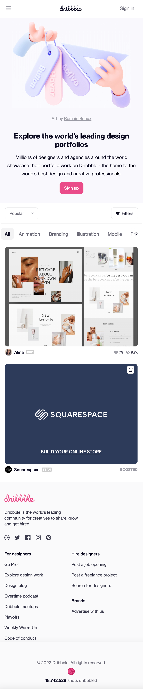
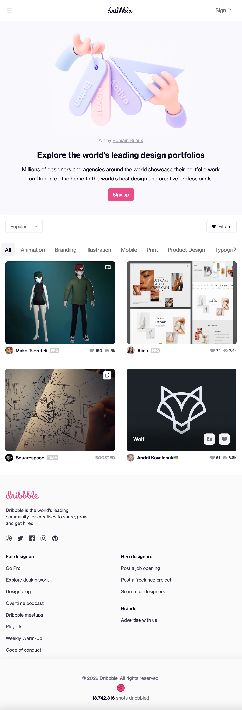
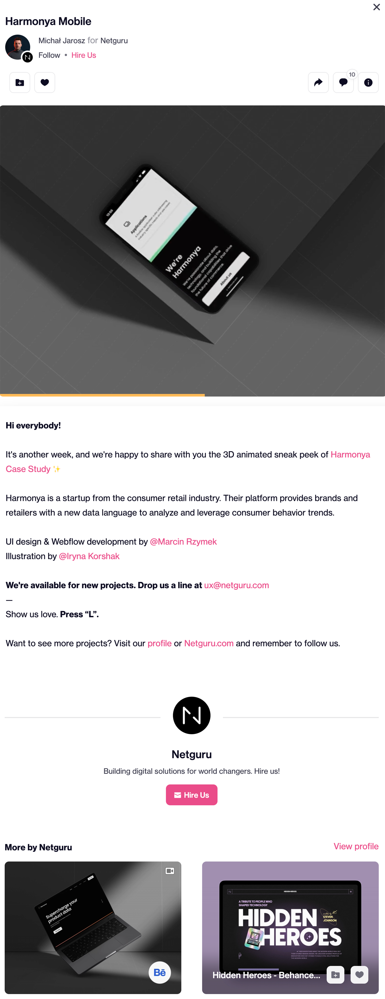
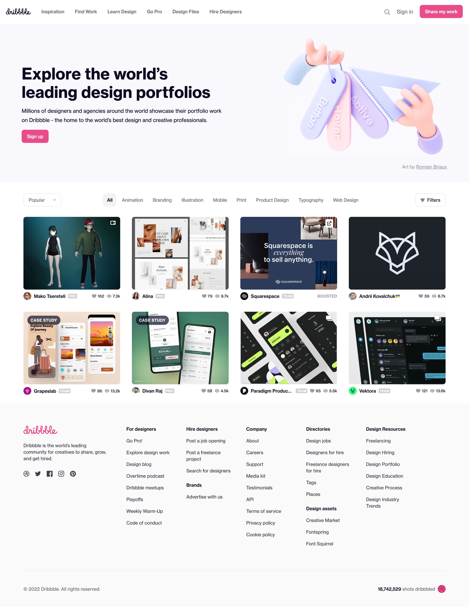
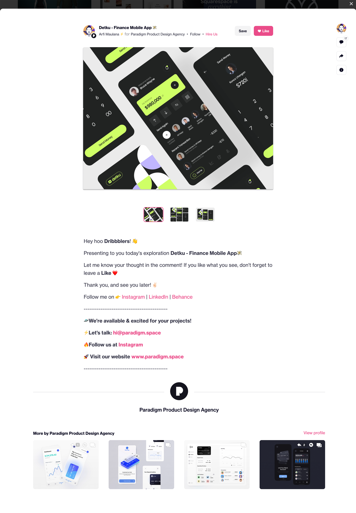

# Procesverslag
Dit document geldt als het procesverslag waarin details zijn verwerkt over het proces die ik heb afgelegd tijdens het opzetten van de website (de opdracht).

## De opdracht

### Details
**Dribbble.com** ga ik grote lijnen namaken.
Voor de opdracht ga ik focus leggen op de weergavelijst van projecten op de homepagina. 
Hierbij zal ik gebruikmaken van;
1. **flexbox** (voor diverse breakpoints).
2. een **css animatie** zal verwerkt worden in een schaalbare menubalk.
3. de css animatie zal geactiveerd worden door **javascript** code.

Tot slot zal er een tweede pagina gemaakt worden, wat een **detail pagina** gaat vormen. De detail pagina is een opvolg pagina als de gebruiker op een van de projecten via de homepagina drukt.

### Screenshots Dribbble

Mobile

Homepage

Detail page

Tablet

Homepage

Detail page

Desktop

Homepage

Detail page

## Toegankelijkheidstest

### Alle bevindingen
1. hier komt bevinding
2. jjjj
3. jkjkj
4. jjkjk

Bevinding 1

#### Titel eerste bevinding
Hier korte omschrijving (met indien nodig een afbeelding)

Hier een omschrijving van hoe het opgelost kan worden (met indien nodig een afbeelding)

Bevinding 1

#### Titel eerste bevinding
Hier korte omschrijving (met indien nodig een afbeelding)

Hier een omschrijving van hoe het opgelost kan worden (met indien nodig een afbeelding)

Bevinding 1

#### Titel eerste bevinding
Hier korte omschrijving (met indien nodig een afbeelding)

Hier een omschrijving van hoe het opgelost kan worden (met indien nodig een afbeelding)

Bevinding 1

#### Titel eerste bevinding
Hier korte omschrijving (met indien nodig een afbeelding)

Hier een omschrijving van hoe het opgelost kan worden (met indien nodig een afbeelding)

## Eind reflectie

### Stand van zaken
hier dit ging goed & dit was lastig (neem ook screenshots op van delen van je website en code)

### Screenshot(s)

Mobile

  

 
Menu

Homepage

[]
Detail page

## Bronnenlijst

continu bijhouden terwijl je werkt

Nb. Wees specifiek ('css-tricks' als bron is bijv. niet specifiek genoeg).

1. https://flaviocopes.com/javascript-async-defer/ voor Javascript in head te verwerken.
2. https://codepen.io/joostf/pen/xEpmLx voor structuur volgorde css file
3. ...

